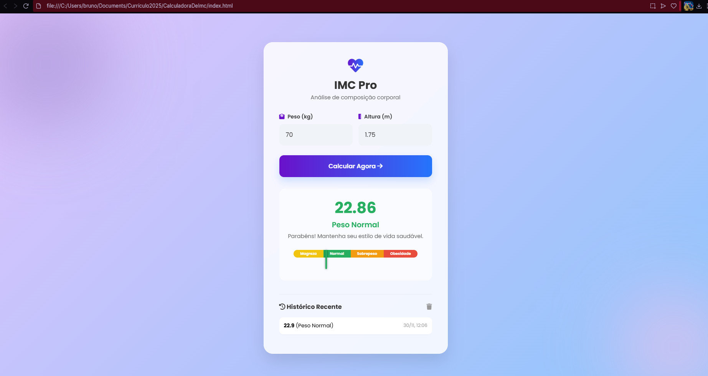

**Calculadora de IMC**
 Visão Geral do Projeto
Esta é uma Calculadora de Índice de Massa Corporal (IMC) desenvolvida com foco em design moderno, usabilidade e responsividade. O projeto não apenas calcula o IMC do usuário com precisão, mas também o apresenta de forma visualmente atraente, utilizando o efeito Glassmorphism e um Gráfico de Posição de IMC para contextualizar o resultado.Ideal para demonstrar habilidades sólidas em manipulação do DOM e estilização avançada (CSS3).

**Funcionalidades Principais:**
Cálculo Preciso de IMC: Calcula o IMC com base no peso (kg) e altura (m).

**Design Glassmorphism:**
Utiliza transparências, desfoques e sombras para criar um visual moderno de "vidro fosco".

**Totalmente Responsivo:** 
O layout se adapta perfeitamente a qualquer dispositivo, desde celulares (mobile first) até telas de desktop.

**Gráfico Visual de Posição:** 
Apresenta uma barra de cores indicando a faixa de peso do usuário (Normal, Sobrepeso, Obesidade, etc.), com um marcador dinâmico movido pelo JavaScript.

**Histórico Local:** 
Armazena os últimos cálculos no localStorage do navegador, permitindo que o usuário acompanhe sua evolução entre as sessões.

**Feedback Personalizado:**
Exibe mensagens de saúde e a categoria de peso correspondente ao IMC calculado.

**Como Executar o Projeto**
É muito fácil rodar este projeto no seu ambiente local:

1- Clone o Repositório:
git clone https://github.com/BrunoRealTavares/Calculadora-de-IMC-Projeto-Final.git

2- Abra o Arquivo: Navegue até a pasta clonada e simplesmente abra o arquivo index.html em qualquer navegador (Chrome, Firefox, etc.).

3- O projeto será carregado instantaneamente, pois não requer dependências de backend (Node.js)

**Demonstração do Design**

Nota: A imagem acima demonstra a interface do usuário e o gráfico visual.
